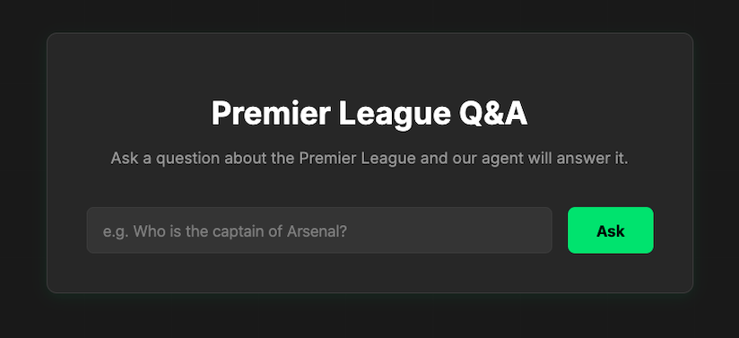
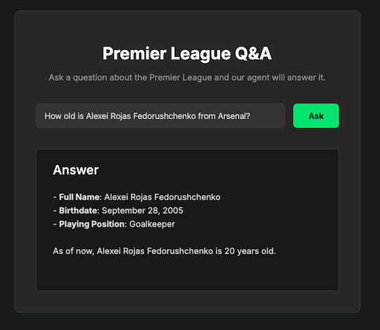
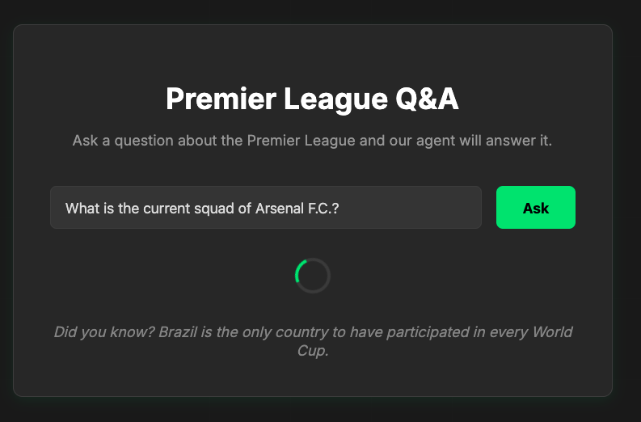
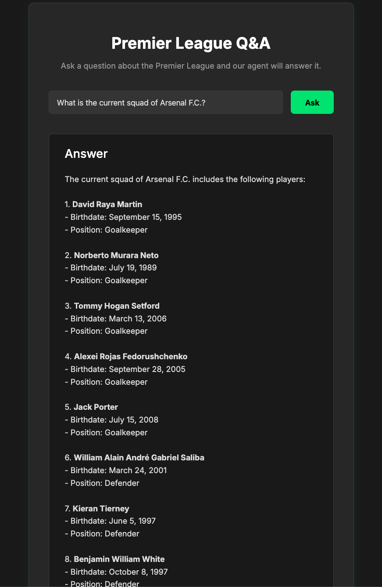

# Premier League Q&A

This project is a conversational AI agent that can answer questions about Premier League football clubs. It provides a simple web interface and a command-line interface for interaction.

## Features

- **Web Interface**: A clean and simple web UI for asking questions.
- **Command-Line REPL**: A command-line interface for developers and terminal lovers.
- **LLM-Powered**: Uses a Large Language Model (LLM) via LangChain to understand and answer questions in a natural way.
- **Real-time Data**: Fetches up-to-date football data from the API-Football external API.
- **Efficient Caching**: Caches API responses to improve performance and stay within API rate limits.

## Architecture

The application is composed of a few key components:

- **Frontend**: A simple user interface built with HTML, CSS, and vanilla JavaScript.
- **Backend**: A FastAPI server that exposes an API to the frontend.
- **AI Agent**: A LangChain-based agent that uses an OpenAI model to process and answer questions.
- **Data Source**: The agent uses tools to fetch data from API-Football.
- **Caching**: A simple file-based cache to store results from API-Football, reducing latency and API usage.

## Getting Started

Follow these instructions to set up and run the project locally.

### Prerequisites

- Python 3.11 (there might be some isort issues with newer versions 3.12+)
- [Poetry](https://python-poetry.org/docs/) for dependency management. If you don't have it installed, see the installation instructions below.

### 1. Clone the Repository

```bash
git clone https://github.com/xxx/pl_squad.git
cd pl_squad
```

### 2. Install Poetry

If you don't have Poetry installed, you can install it by running the following command in your terminal. This is the official and recommended way.

**macOS, Linux, WSL:**
```bash
curl -sSL https://install.python-poetry.org | python3 -
```

**Windows (PowerShell):**
```powershell
(Invoke-WebRequest -Uri https://install.python-poetry.org -UseBasicParsing).Content | py -
```

For more installation options, please refer to the [official Poetry documentation](https://python-poetry.org/docs/#installation).

### 3. Install Dependencies

Use Poetry to install the project's dependencies. This command will create a virtual environment for the project and install all the necessary packages.

```bash
poetry install
```

### 4. Activate the Virtual Environment

To activate the virtual environment managed by Poetry, run:

```bash
poetry shell
```
This will spawn a new shell within the virtual environment. All subsequent commands should be run in this shell.

### 5. Configure Environment Variables

The application requires API keys for OpenAI and API-Football.

1.  Create a file named `.env` in the root of the project.
2.  Add the following variables to the `.env` file:

    ```env
    # Get your key from https://rapidapi.com/api-sports/api/api-football
    RAPIDAPI_KEY="Your-API-Football-Key"

    # Your OpenAI API Key
    OPENAI_API_KEY="sk-..."
    OPENAI_MODEL="gpt-4o-mini"
    OPENAI_TEMPERATURE="0.0"
    ```

You can get an `RAPIDAPI_KEY` by subscribing to the free plan of the [API-Football API on RapidAPI](https://rapidapi.com/api-sports/api/api-football).

### API Rate Limits and Caching

The free plan for API-Football on RapidAPI has a limit of **100 requests per day** and a rate limit of **30 requests per minute**. To work around this limitation during development, the application runs in a **"dev mode"** by default.

In this mode, the application reads data from a local cache instead of making live API calls. The cache is located in the `cache/` directory.

!!! Dev mode allows only to ask questions about Arsenal squad in current season !!!

To populate the cache with fresh data from the API, you can run the following command:

```bash
poetry run python pl_squad/fetch_and_cache.py
```

This script will fetch data for the clubs defined in `pl_squad/fetch_and_cache.py` and store it in the cache files. Running this will use up your API quota, so use it sparingly.

## Usage

You can interact with the agent through either the web application or the command-line interface.

### Running the Web Application

To start the web server, run the following command:

```bash
poetry run poe web
```

Then, open your web browser and navigate to [http://127.0.0.1:8000](http://127.0.0.1:8000).

### Running the Command-Line Interface (CLI)

To use the CLI, run this command in your terminal:

```bash
poetry run python -m pl_squad
```

You will be prompted to ask questions directly in your terminal.

## Project Structure

Here is an overview of the key files and directories in the project:

```
pl_squad/
├── cache/                  # Stores cached data from the football API
├── img/                    # Contains images for the README
├── pl_squad/
│   ├── __main__.py         # Entry point for the CLI application
│   ├── agents/             # Contains the core agent logic
│   ├── api/                # Wrapper for the external API-Football
│   ├── web/                # FastAPI application and frontend files
│   ├── config.py           # Application configuration
│   ├── fetch_and_cache.py  # Caching logic
│   └── tools.py            # Tools for the LangChain agent
├── tests/                  # Tests for the application
├── .env.example            # Example environment file
├── pyproject.toml          # Project metadata and dependencies
└── README.md               # This file
```


## Screenshots

Here's a sneak peek of the web application in action:

_Main view of the application:_


_Asking a question about a player:_



_Waiting for the answer:_


_Receiving a detailed answer:_

